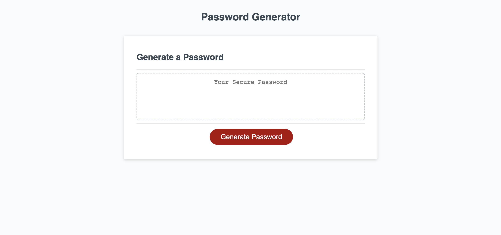

# Modification of starter code to create random password generator

## Description
The goal of this project was to supplement the provided starter code with additional code to create a password generator that would randomize passwords of specific length and character type. Although the starter code included HTML, CSS, & JavaScript, only the JavaScript was modified in order to faciliate a functioning password generator. To elaborate, each password can contain a length of 8-128 characters and include upper case letters, lower case letters, numbers, and/or special characters according to the user's specifications. This project consisted of declaring all variables used in the password generator, formulating a function to generate a random password of specific legnth rounded to the nearest integer, and then calling that password to display in the main box.

## Table of Contents
N/A

## Installation
N/A

## Usage
Website: https://mvasireddy2022.github.io/Password-Generator/

## License
MIT License